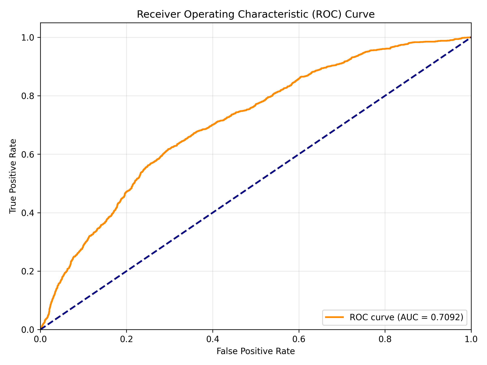

# Intelligent Vision Assignment 2: Weakly-Supervised Video Anomaly Detection

A simplified re-implementation of the CVPR 2018 paper ["Real-World Anomaly Detection in Surveillance Videos"](https://openaccess.thecvf.com/content_cvpr_2018/papers/Sultani_Real-World_Anomaly_Detection_CVPR_2018_paper.pdf) for coursework assignment.

This implementation uses **Multiple Instance Learning (MIL)** with deep ranking to detect anomalies in surveillance videos using only video-level labels during training.

---

## Table of Contents
- [Overview](#overview)
- [Project Structure](#project-structure)
- [Dataset](#dataset)
- [Installation](#installation)
- [Quick Start](#quick-start)
- [Configuration](#configuration)
- [Results](#results)
- [Implementation Details](#implementation-details)
- [References](#references)

---

## Overview
### Key Features
- **Weakly-supervised learning**: Only video-level labels (normal/anomaly) required for training
- **MIL Ranking Loss**: Learns to rank anomalous segments higher than normal segments
- **Pre-extracted C3D features**: No need for video processing or feature extraction
- ~3.9 GB dataset size (features only)
- 9-13 batches per epoch on subset

### What This Implementation Includes
✅ MIL ranking loss with sparsity and temporal smoothness constraints  
✅ Balanced batch sampling (30 positive + 30 negative bags)  
✅ Frame-level evaluation with ROC-AUC metric  

---

## Project Structure

```bash
AnomalyDetectionSubset/
├── README.md                      # This file
├── requirements.txt               # Python dependencies
├── configs/
│   └── default.yaml              # Training configuration
├── data/
│   ├── annotations/
│   │   ├── train_subset.txt      # Training video list
│   │   ├── test_subset.txt       # Testing video list
│   │   └── Temporal_Anomaly_Annotation_for_Testing_Videos.txt
│   └── features/                 # C3D features (32 segments × 4096-dim per video)
│       ├── Abuse/
│       ├── Arson/
│       ├── Assault/
│       ├── Burglary/
│       ├── Explosion/
│       ├── Fighting/
│       ├── RoadAccidents/
│       ├── Robbery/
│       ├── Shooting/
│       ├── Shoplifting/
│       ├── Stealing/
│       ├── Vandalism/
│       ├── Training_Normal_Videos_Anomaly/
│       └── Testing_Normal_Videos_Anomaly/
├── models/
│   ├── anomaly_detector.py      # 3-layer FC network
│   └── loss.py                   # MIL ranking loss
├── utils/
│   ├── dataset.py                # PyTorch dataset
│   ├── sampler.py                # Balanced batch sampler
│   └── logger.py                 # wandb logger
├── scripts/
│   ├── create_annotations.py    # Generate train/test split
│   ├── check_feature_shapes.py  # Verify feature dimensions
│   ├── test_dataset.py          # Dataset sanity check
│   └── test_model.py            # Model sanity check
├── train.py                      # Training script
└── evaluate.py                   # Evaluation script
```

---

## Dataset

### UCF-Crime Subset

This project uses UCF-Crime dataset:

**Why only features?**  
The full UCF-Crime dataset with videos is > 110 GB, which is impractical for Google Colab. Provide only **C3D features** (3.9 GB) for efficient training.

### Dataset Statistics

| Split | Anomaly | Normal | Total | Batches/Epoch |
|-------|---------|--------|-------|---------------|
| Train | 810     | 800    | 1,610 | 26            |
| Test  | 140     | 150    | 290   | -             |
| **Total** | **950** | **950** | **1,900** | - |

### Download Dataset

**Option 1: Pre-extracted C3D Features (Recommended)**
```bash
# Download from Google Drive (link provided by instructor)
# Extract to ./data/features/
```

**Option 2: Full UCF-Crime Dataset**
- Original dataset: [Dropbox Link](https://www.dropbox.com/sh/75v5ehq4cdg5g5g/AABvnJSwZI7zXb8_myBA0CLHa?dl=0)
- C3D Features & Annotations: [Google Drive](https://drive.google.com/drive/folders/18gcJ9RxntCto1IQwLRNg7r9zOyLV41Wu?usp=sharing)

*Note: Features are from [ekosman's implementation](https://github.com/ekosman/AnomalyDetectionCVPR2018-Pytorch)*

---

## Installation
Tested on Ubuntu 24.04, NVIDIA GeForce 3080Ti

### Prerequisites
- Python 3.9+
- CUDA-capable GPU (recommended)

### Setup

1. **Clone the repository**
```bash
git clone <repository-url>
cd <repository>
```

2. **Create conda environment**
```bash
conda create -n anomaly python=3.9 -y
conda activate anomaly
```

3. **Install dependencies**
```bash
pip install -r requirements.txt
```

### Requirements
```txt
torch>=2.0.0
numpy>=1.24.0
scipy>=1.10.0
matplotlib>=3.7.0
scikit-learn>=1.3.0
wandb>=0.15.0
pyyaml>=6.0
tqdm>=4.65.0
```

---

## Quick Start

### 1. Prepare Dataset

After downloading features, create train/test annotations:

```bash
python scripts/create_annotations.py
```

This will generate:
- `data/annotations/train_subset.txt`
- `data/annotations/test_subset.txt`

### 2. Verify Setup

Test dataset loading:
```bash
python test_dataset.py
```

Test model forward pass:
```bash
python test_model.py
```

### 3. Train Model

**Basic training:**
```bash
python train.py --config configs/default.yaml
```

**Without wandb logging:**
```bash
python train.py --no-wandb
```

**Custom config:**
```bash
python train.py --config configs/experiment.yaml
```

### 4. Evaluate Model

```bash
python evaluate.py \
    --config configs/default.yaml \
    --checkpoint checkpoints/best_model.pth \
    --temporal-annotation data/annotations/Temporal_Anomaly_Annotation_for_Testing_Videos.txt
```

**Output:**
- `results/roc_curve.png` - ROC curve visualization
- `results/evaluation_results.json` - Raw predictions
- `results/evaluation_summary.txt` - Performance summary

---

## Configuration

### Default Configuration (`configs/default.yaml`)

```yaml
wandb:
  project: "IntelligentVision_UCF-Crime_Subset"
  entity: null  # Leave null to use your default W&B account

data:
  feature_path: "data/features/"
  train_annotation_path: "data/annotations/train_subset.txt"
  test_annotation_path: "data/annotations/test_subset.txt"

model:
  input_dim: 4096
  hidden_dims: [512, 32]
  dropout: 0.6

training:
  batch_size: 60          # 30 positive + 30 negative
  learning_rate: 0.001
  num_epochs: 100
  lambda1: 0.00008        # Temporal smoothness
  lambda2: 0.00008        # Sparsity
  lambda3: 0.01           # Weight decay
  optimizer: "adam"       # or "adagrad"
```

### Key Hyperparameters

| Parameter | Value | Description |
|-----------|-------|-------------|
| `batch_size` | 60 | 30 positive + 30 negative bags |
| `lambda1` | 8e-5 | Temporal smoothness constraint |
| `lambda2` | 8e-5 | Sparsity constraint |
| `lambda3` | 0.01 | Weight decay (L2 regularization) |
| `dropout` | 0.6 | Dropout rate |

---

## Results

### Sample ROC Curve


Training on the 3-class subset should produce results similar to:

```
============================================================
AUC: 0.7092
============================================================

Optimal threshold: 0.0302
  TPR: 0.6178
  FPR: 0.2969
```

---

## Implementation Details

### Architecture

**Anomaly Detector (3-layer FC network):**
```
Input (4096) 
  → FC1 (512) + ReLU + Dropout(0.6)
  → FC2 (32) + ReLU + Dropout(0.6)
  → FC3 (1) + Sigmoid
  → Output: Anomaly score [0, 1]
```

### Loss Function

**MIL Ranking Loss:**
```
L = max(0, 1 - max(S_pos) + max(S_neg))
    + λ1 × Σ(s_i - s_{i+1})²     # Smoothness
    + λ2 × Σ(s_i)                # Sparsity
```

Where:
- `S_pos`: scores of positive bag (anomaly video)
- `S_neg`: scores of negative bag (normal video)
- `s_i`: score of i-th segment

### Training Strategy

1. **Balanced Sampling**: Each batch has exactly 30 anomalous + 30 normal videos
2. **Segment-level Prediction**: 32 segments per video
3. **Bag-level Supervision**: Only video-level labels (no temporal annotations)
4. **Ranking Objective**: Anomalous segments should score higher than normal

---

## Troubleshooting

### Common Issues

**1. CUDA out of memory**
```bash
# Reduce batch size in configs/default.yaml
training:
  batch_size: 40  # Instead of 60
```

**2. W&B permission error**
```bash
# Remove entity or use --no-wandb
python train.py --no-wandb
```

**3. Feature shape mismatch**
```bash
# Verify all features are (32, 4096)
python scripts/check_feature_shapes.py
```
---

## Experiment Tracking

### Weights & Biases

This project integrates with [Weights & Biases](https://wandb.ai) for experiment tracking.

**Setup:**
```bash
wandb login
```

**Metrics logged:**
- Training loss (total, ranking, smoothness, sparsity)
- Learning rate
- Epoch time
- Model checkpoints

---

## Extensions (Optional)
### Try Different Features

Replace C3D features with ResNet-101 or ResNet-152:
- Update `model.input_dim` in config
- Download alternative features from links above

---

## References

### Paper
```bibtex
@inproceedings{sultani2018real,
  title={Real-world anomaly detection in surveillance videos},
  author={Sultani, Waqas and Chen, Chen and Shah, Mubarak},
  booktitle={Proceedings of the IEEE conference on computer vision and pattern recognition},
  pages={6479--6488},
  year={2018}
}
```

### Code References
- **Original Implementation**: [WaqasSultani/AnomalyDetectionCVPR2018](https://github.com/WaqasSultani/AnomalyDetectionCVPR2018)
- **PyTorch Version**: [ekosman/AnomalyDetectionCVPR2018-Pytorch](https://github.com/ekosman/AnomalyDetectionCVPR2018-Pytorch)

### Dataset
- **UCF-Crime**: [Project Page](http://crcv.ucf.edu/projects/real-world/)
- **Paper**: [Link](https://openaccess.thecvf.com/content_cvpr_2018/papers/Sultani_Real-World_Anomaly_Detection_CVPR_2018_paper.pdf)

---

## License

This project is for educational purposes only. Please cite the original paper if you use this code or dataset.

---

## Acknowledgments

- Original authors: Waqas Sultani, Chen Chen, Mubarak Shah
- Feature extraction: [ekosman](https://github.com/ekosman)
- Course: Intelligent Vision (Sungkyunkwan University)

---
